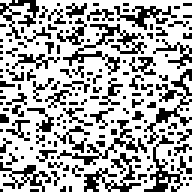
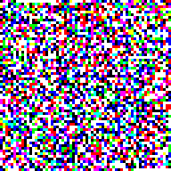

# MakoCode🐾

A standard for color barcode printing with high density, designed for long-term archiving on paper or film. Self-contained clean-room implementation with no dependencies, single file.

Stubborn and dense as a Shiba, with no fluff. Lovingly named after my Shiba Inu, Mako 🐕.

Written entirely with codex-gpt-5.

## Usage

```
make
make test
./makocode encode --input=file.txt
./makocode encode --input=file.txt --palette "White Cyan Magenta Yellow Black"
# Print, store, scan the output shown above
./makocode decode scan.ppm
```

Pass `--debug` (e.g., `./makocode --debug encode ...`) if you need the verbose diagnostic logs that were previously always emitted.

### Converting Scans

To turn a scanned image into a `.ppm` file for decoding, install ImageMagick (`brew install imagemagick` on macOS, `sudo apt install imagemagick` on Debian/Ubuntu) and run `convert scan.png scan.ppm`.

### Custom Palettes (Base-N Mode)

- Pass `--palette "White ... Black"` to `encode`/`decode` to define a custom color alphabet. The five entries must include `White` first, `Black` last, and any ordering of `Cyan`, `Magenta`, `Yellow` in the middle.
- The encoder automatically maps each page’s bitstream into base‑5 digits using that palette, so every non-reserved pixel uses one of the supplied colors. Footer backgrounds/text colors follow the first/last palette entries.
- Palette metadata is embedded per page (via `MAKOCODE_PALETTE` / `MAKOCODE_PAGE_SYMBOLS`), so `decode` normally discovers the palette automatically, but you can still force it with `--palette ...` if desired.

## Sample Barcodes

Examples of the encoded output for channel colors 1-3:




