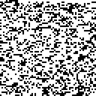
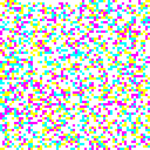
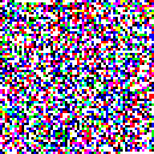

# MakoCode🐾

A standard for color barcode printing with high density, designed for long-term archiving on paper or film. Self-contained clean-room implementation with no dependencies, single file.

Stubborn and dense as a Shiba, with no fluff. Lovingly named after my Shiba Inu, Mako 🐕, and about as silly as him.

Written entirely with codex-gpt-5.

## Dependencies

Totally standalone for future-proofing, c++ and g++ required for compiling. CLI tests require bash.

## Usage

```
make
make test
./makocode encode --input=file.txt
./makocode encode --input=file.txt --palette "White Black"
# Print, store, scan the output shown above
./makocode decode scan.ppm
```

Pass `--debug` (e.g., `./makocode --debug encode ...`) if you need the verbose diagnostic logs that were previously always emitted.

## Tests

`make test` now drives the CLI end-to-end through the shell scripts in `scripts/`
(round-trip, payload suite, overlay, CLI output-dir, and decode failure cases).
Artifacts for debugging are written to `test/` using the labels defined in each
script (e.g., `3001_random_payload*`, `2005_payload_gray_100k_*`).

Each `make test` run prints its master seed and writes it to `test/test_seed.txt`.
Repeat a randomized run with the same seed using:

```
MAKO_TEST_SEED=$(cat test/test_seed.txt) make test
```

You can also choose a seed explicitly, for example `MAKO_TEST_SEED=12345 make test`.
Random payload seeds are derived from the master seed and test label, so each case
gets a stable payload when replayed.

### Coverage

To run the same end-to-end suite with GCC/gcov instrumentation and produce an
HTML coverage report, install `lcov` (which also ships `genhtml`) and run:

```
make coverage
```

This rebuilds `makocode` with `--coverage -O0 -g`, executes every case in
`scripts/run_test_suite.sh`, and writes `test/makocode.info` plus an HTML
dashboard under `test/coverage/index.html`.

### Converting Scans

To turn a scanned image into a P3 `.ppm` file for decoding, install ImageMagick (`brew install imagemagick` on macOS, `sudo apt install imagemagick` on Debian/Ubuntu) and run `convert scan.png -compress none scan.ppm`.

### Custom Palettes (Base-N Mode)

- Pass `--palette "Color ..."` to `encode`/`decode` with 2–16 unique entries selected from the existing names (`White`, `Cyan`, `Magenta`, `Yellow`, `Black`). Examples: `--palette "White Black"` (binary), `--palette "White Cyan Magenta"` (base‑3), `--palette "White Cyan Magenta Yellow Black"` (base‑5). Quote the list so the CLI keeps the whitespace intact.
- The encoder automatically maps each page’s bitstream into base‑N digits (where `N` equals the palette length), pads out every non-reserved pixel, and chooses footer foreground/background colors by measuring palette contrast—no need for fixed White/Black endpoints.
- Palette metadata is embedded per page (via `MAKOCODE_PALETTE`, `MAKOCODE_PALETTE_BASE`, and `MAKOCODE_PAGE_SYMBOLS`), so `decode` normally discovers the palette automatically, but you can still force it with `--palette ...` if desired.

## Sample Barcodes

Examples of the encoded output for 2, 4, and 8 colors:




